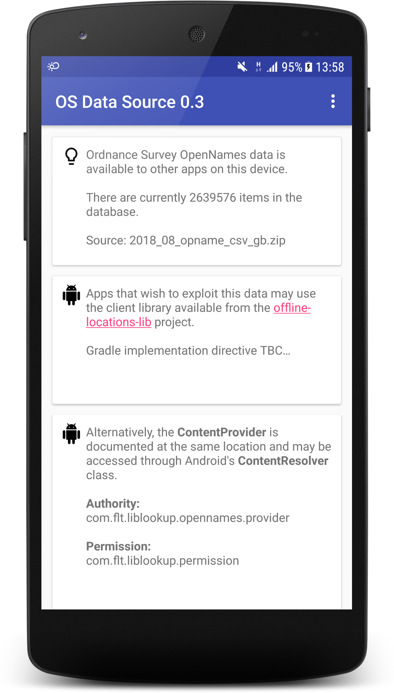
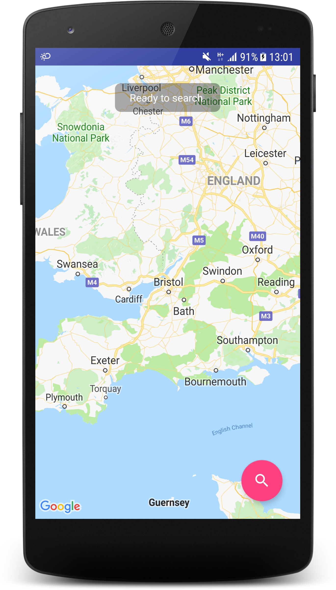
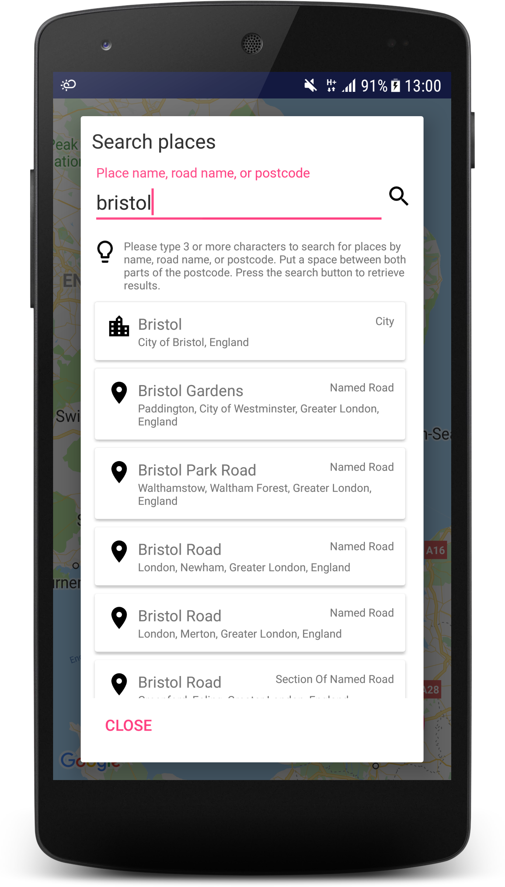

# Offline Locations Lib
The Offline Locations Lib allows you to build Android apps that can query an offline database of [Ordnance Survey OpenNames](https://www.ordnancesurvey.co.uk/business-and-government/products/os-open-names.html) locations (including places, roads, and postcodes) across the UK.

The OS Data Source app first indexes data from an OS OpenNames download, and then makes it available to other apps on the same Android device using the Android [Content Provider](https://developer.android.com/guide/topics/providers/content-providers) interface.

The client library allows you to access this through simple classes, and provides a UI for simple searching.

## Try it now
1. Install the [Ordnance Survey Offline Data Source](https://play.google.com/store/apps/details?id=com.flt.applooukpprovider) app from Google Play.
2. Open the app, and choose to extract the data.
3. Once this is done, download the [Offline Places Sample Client](https://play.google.com/store/apps/details?id=com.flt.applookupclientsample) app from Google Play.
4. Open it, and use the floating action button to search for a location, eg. Bristol.

The search takes place entirely offline, by communication with the Content Provider contained in the Offline Data Source app.

_NB. The sample app is illustrative and uses Google Maps as a base map. The map itself __does__ require internet access to render._

OS Data Source  | Sample app  | Sample app search dialog 
------------ | ------------- | -------------
 |  | 

## Install using Gradle
To add the offline location library using gradle, add the following directive to your project's build.gradle file:

```
allprojects {
    repositories {
        ...
        maven {
            url  "https://dl.bintray.com/front-line-tech/android-libs"
        }
    }
}
```

Add the following implementation lines to your module's build.gradle:

```
dependencies {
    ...
    implementation 'front-line-tech.android-libs:offline-locations-lib:1.1'
    implementation 'com.mapbox.mapboxsdk:mapbox-android-sdk:6.4.0'
}
```

## Usage

### Using the provided search dialog

First implement the ```AbstractPlacesSearchDialog```. This dialog shows a search box, with a button to search. The keyboard is also configured to offer a search key that also triggers a search. The user may type a location name, partial location name, road name, partial road name, or postcode.

You will need to provide a ```getOrigin``` method to the dialog - this allows the search to be focussed on a particular location (eg. the current focus of the user's map).

You may return ```null``` if you do not have access to the map (or user's current) location. In that case, search results will not be prioritised by closeness to a point.

```java
AbstractPlacesSearchDialog dialog = new AbstractPlacesSearchDialog(this, dialog_listener) {
    @Override
    protected LatitudeLongitude getOrigin() {
        CameraPosition camera = map.getCameraPosition();
        return new LatitudeLongitude(camera.target.latitude, camera.target.longitude);
    }
};

dialog.show();
```

Implement your dialog listener, too:

```java
private AbstractPlacesSearchDialog.Listener dialog_listener = new AbstractPlacesSearchDialog.Listener() {
    @Override
    public void on_cancel() {
      // The user has cancelled the search.
    }

    @Override
    public void on_select(OpenNamesPlace result) {
      Double x = OpenNamesHelper.getX(result);
      Double y = OpenNamesHelper.getY(result);

      if (x == null || y == null) {
        // This returned location does not seem to have Eastings or Northings.

      } else {
        // We have enough information to move our map to the chosen location.
        LatitudeLongitude location = GeoConverter.osEastNorth_to_latLng(x, y);
        LatLng latLng = new LatLng(location.getLatitude(), location.getLongitude());
        map.moveCamera(CameraUpdateFactory.newLatLng(latLng));
      }
    }
  };
```

### Searching directly
The dialog provided is not particularly flexible, and so you may wish to initiate a search yourself instead. You can do this using the ```AbstractSearchTask``` class (an extension of ```AsyncTask```).

At a minimum, implement ```onPostExecute```, and parse the ```AbstractSearchTask.Result``` returned to you.

The following fields are present on the ```Result``` class:
* ```String search``` - the original partial search string provided.
* ```LatitudeLongitude origin``` - the origin location provided (or null).
* ```Collection<OpenNamesPlace> places``` - any places found matching the search.
* ```boolean success``` - ```true``` if the search was considered successful (even if nothing was found).
* ```Exception exception``` - ```null``` unless an Exception was thrown during the search.

The ```OpenNamesPlacesResultsAdapter``` class illustrates how to sort and format the results as a ```RecyclerView.Adapter```.

```java
AbstractSearchTask task = new AbstractSearchTask(this.client) {
    protected void onPreExecute() {
        super.onPreExecute();
        // Update the UI to indicate that searching has begun.
    }

    protected void onPostExecute(Result result) {
        super.onPostExecute(result);
        try {
            // Update the UI with:
            // result.search (showing the original search)
            // result.places (showing a full list of places found)
        } catch (Exception e) {
            Log.e(AbstractPlacesSearchDialog.TAG, "Error updating results from search.", e);
        }

        try {
            // Update the UI to indicate that searching has completed.
        } catch (Exception ex) {
            Log.e(AbstractPlacesSearchDialog.TAG, "Error updating busy state.", ex);
        }
    }
};

task.execute(new Params[]{new Params(partial_search_string, origin_location)});
```

### Access through a ContentResolver (without the client library)
In order to access the results directly, use Android's ```ContentResolver``` with the following:
* __Authority:__ ```com.flt.liblookup.opennames.provider```
* __Permission:__ ```com.flt.liblookup.permission```

## Building the Provider
The Provider builds with 2 flavours:
* __Asset:__ The Ordnance Survey data file is included as an asset inside the final apk.
* __ApkExpansion:__ The Ordnance Survey data file must be included as a separate APK expansion file through Google Play.

Google Play (and some other distribution services including HockeyApp) limit the permitted maximum APK size. To work around this, use the __ApkExpansion__ flavour and include the OS data file as a separate APK expansion file.

Where you are able to distribute the APK yourself (perhaps through adb, or another mechanism), you may find it easier to distribute the __Asset__ flavour which does not require an additional file.
